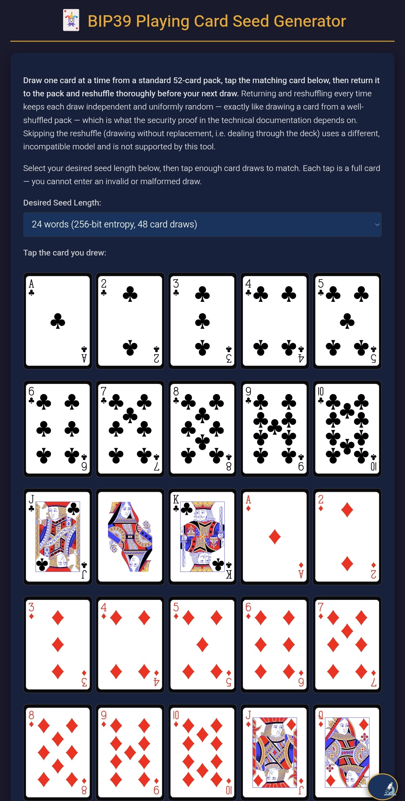
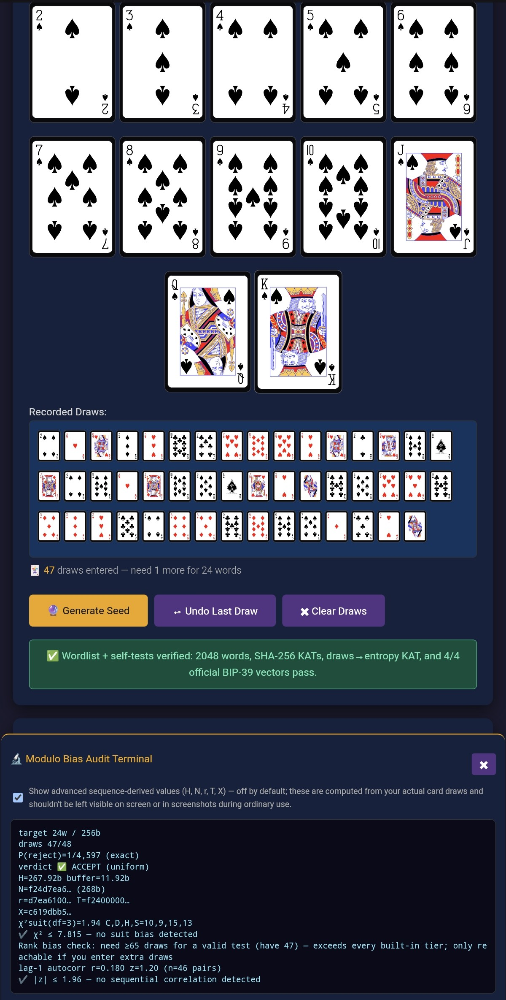
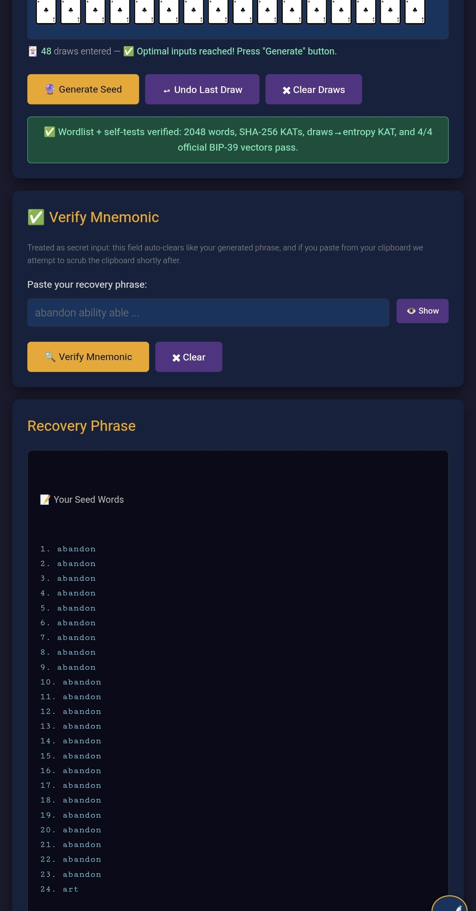
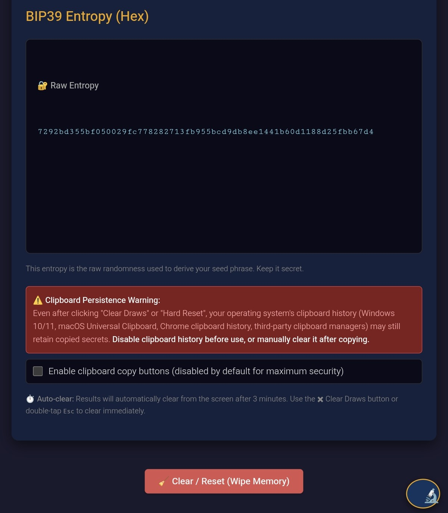

# 🃏 BIP39 Playing Card Seed Generator

Convert physical playing card draws into mathematically rigorous BIP-39 seed phrases. 

This is a single, offline, network-free HTML file. It is a dumb calculator: it provides zero entropy of its own. The randomness comes entirely from the physical universe—your shuffling of a standard 52-card deck.


[](LICENSE)
[]()


## Screenshots

<p float="left">
  
  
  
  
</p>

## Core Philosophy: Zero Extraction, Exact Sampling

Most "cards-to-seed" tools on the internet contain a fatal mathematical flaw: they allow you to deal through a single deck (drawing *without replacement*). A single 52-card deck contains exactly **225.58 bits** of entropy ($\log_2(52!)$). This is mathematically insufficient to generate a 24-word (256-bit) BIP-39 seed. To bypass this, other tools secretly run your deck string through a SHA-256 extractor to "stretch" it to 256 bits. 

**This tool refuses to do that.** 

We demand you draw **with replacement** (record the card, return it to the deck, and reshuffle). This guarantees an infinite stream of independent, identically distributed (i.i.d.) uniform random variables. Each draw yields exactly $\log_2(52) \approx 5.7004$ bits of entropy. 

The accumulated bits are converted to binary via **exact bounded rejection sampling**. There is no modulo bias, no hash-based stretching, and no extractor assumption. SHA-256 is used in this pipeline *exactly once*, at the precise step the BIP-39 specification mandates: deriving the checksum bits for the final word.

## The Math & Tiers

Because we use a base-52 stream with exact rejection sampling, we target the BIP-39 bit requirements plus a small entropy buffer to ensure the sampling shortfall is negligible (any extra draws are absorbed, never wasted).

| Seed Length | Entropy Required | Theoretical Min Draws | **Tool Requirement (with buffer)** |
| :--- | :--- | :--- | :--- |
| **12 Words** | 128 bits | 23 | **25 draws** |
| **15 Words** | 160 bits | 29 | **31 draws** |
| **18 Words** | 192 bits | 34 | **36 draws** |
| **21 Words** | 224 bits | 40 | **42 draws** |
| **24 Words** | 256 bits | 45 | **48 draws** |

## Security & Air-Gap Hygiene

*   **Zero Network Calls:** The file makes no external requests. No analytics, no CDNs, no fonts. 
*   **Fail-Closed Integrity:** On load, the tool runs Known Answer Tests (KATs) against the BIP-39 wordlist, its internal SHA-256 implementation, and the `cardsToEntropy` derivation function. If any self-test fails, the UI refuses to generate a seed.
*   **Volatile Memory:** The generated phrase and raw entropy auto-clear from the screen after 3 minutes.
*   **Clipboard Scrubbing:** Copy buttons are disabled by default. If enabled and used, the tool attempts to overwrite and clear the clipboard shortly after copying. Use the **🧹 Clear / Reset (Wipe Memory)** button to instantly nullify all inputs and variables.
*   **Audit Terminal:** A built-in modulo bias and sequence audit terminal allows you to verify the math on your specific physical draws. Advanced sequence-derived values are hidden by default to prevent shoulder-surfing or accidental screenshots.

## UI & Art Attribution

The UI features a dynamic flexbox layout that scales from 4 cards per row on small phones up to 13 cards per row (full suits) on desktop. 

The crisp SVG card art is sourced from **[cards.revk.uk](https://cards.revk.uk/)** and is in the public domain. The art has been sanitized to inert `<path>` data and embedded directly into the HTML to maintain the single-file, zero-dependency architecture.

### Known Browser Quirks

1.  **The "Not Secure" Banner:** When opening a local file, Chromium-based browsers (Brave, Opera, Chrome) may display a "Not Secure" or "Identity not verified" warning because there is no TLS certificate. **This is expected and irrelevant.** The tool performs no network activity; your secrets never traverse a connection. Integrity is established by the SHA-256 sidecar and signed releases, not HTTPS.
2.  **Night Mode / Eye Protection Pips:** Some mobile browsers (e.g., Xiaomi/Mi Browser) apply forced-dark heuristics that remap pure-black fills on light backgrounds. If your Clubs and Spades number pips look "washed out" or grey, disable your browser's night mode or eye-protection feature for this page. The tool's native dark theme does not require browser intervention.

## Provenance & Signed Releases

Release tags (September 2026 onward) are signed with the account SSH signing key — the same key covers all of IanMcLo's repositories.

Fingerprint (SHA256): `6D+lcVxQsXH+3QK+x6luF5L7tdjajExZSKGJQuPcqZo`

Verify: 
```bash
git verify-tag <tag> --show-signature
```

Full scope, safe harbor, and reporting policy: see [SECURITY.md](SECURITY.md).

## License

MIT License. Verify the fingerprint, everything else is yours to use.# 🎲 BIP39 Dice Roll Seed Generator
